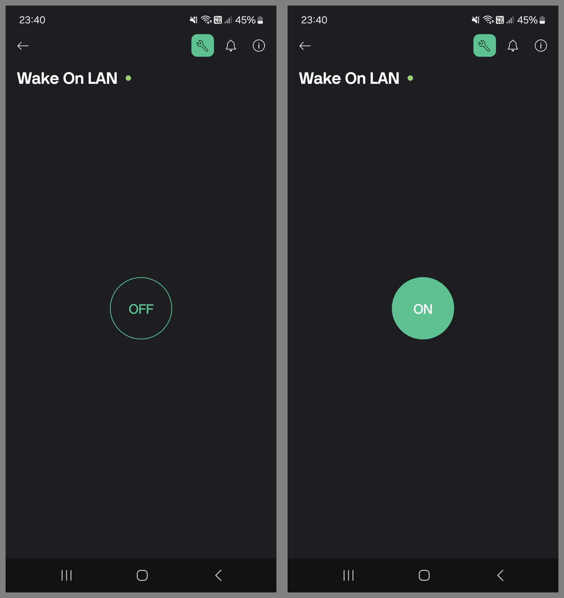

# remote-wake-on-lan

### What is this
This project aims to remotely turn on a computer over internet. The [Wake on LAN](https://en.wikipedia.org/wiki/Wake-on-LAN) standard allows a device to be turned on using a special network packet sent by another device in the same network. In this case, this packet is sent by an ESP8266 based board, and the board is triggered remotely from a [Blynk](https://blynk.io/) Cloud project connected via internet. The Blynk project is accessed from the official Blynk mobile app, and a button in the app UI sends the trigger signal.  

The complete implementation, is the following:  
Blynk App -> Blynk Cloud -> ESP8266 -> WoL signal -> Computer

### Mobile app

